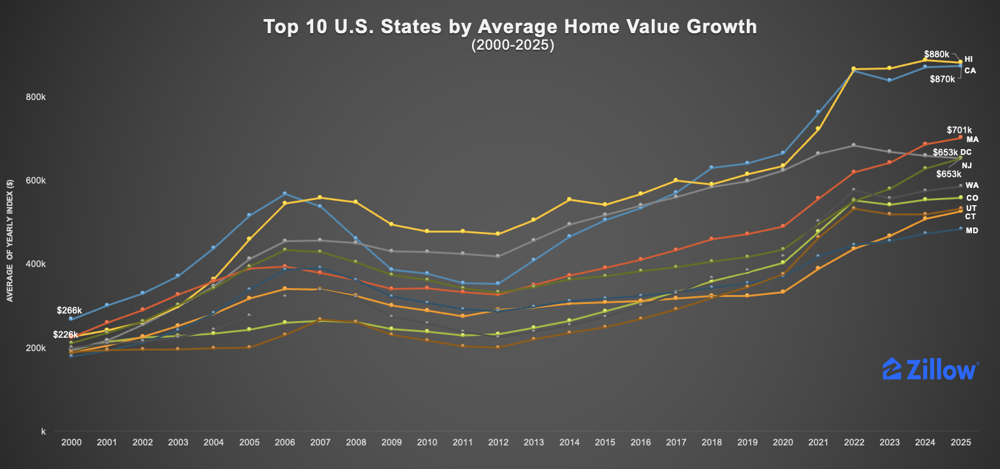
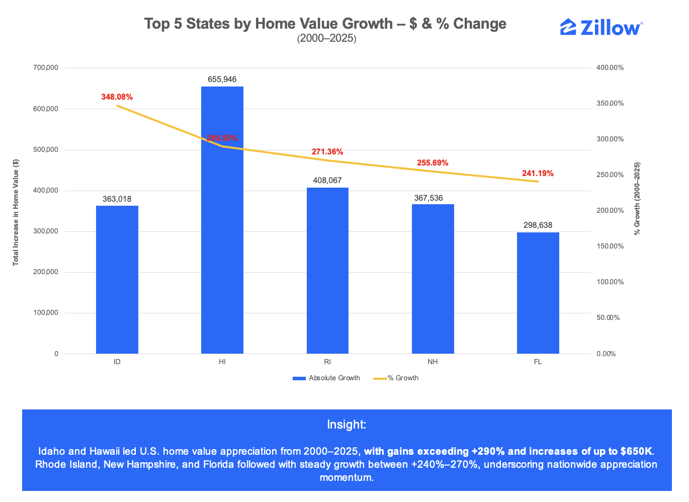
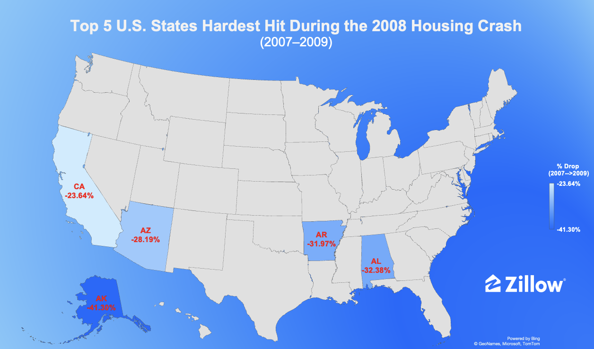
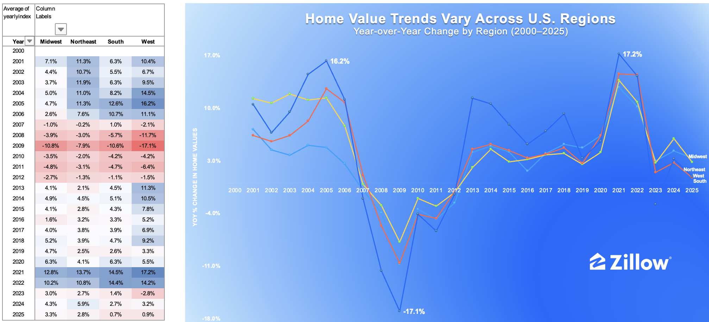

## 🏠 U.S. Home Value Index Analysis (Zillow ZHVI)
### 📊 Project 01 | U.S. Housing Market Analytics Portfolio

---

### 🏗️ Background
This project analyzes U.S. housing market trends from **2000 to 2025** using the **Zillow Home Value Index (ZHVI)** dataset.  
It explores **long-term home-value appreciation, regional disparities, volatility, and post-crisis recovery**, providing **data-driven insights** for **real-estate investors, developers, and policymakers**.

---

### 📘 Executive Summary
This project delivers a **comprehensive Excel-based analysis** of the Zillow Home Value Index (ZHVI) to understand **state-level housing dynamics** across the U.S. (2000–2025).  
It transforms raw housing data into **clear, stakeholder-ready insights** that reveal how appreciation and volatility differ across regions.

> **Headline Insight:** From 2000 to 2025, U.S. home values rose by **+140%**, from **$153K → $366K**, led by the **West and South**—strong growth balanced by higher volatility than inland states.

The analysis demonstrates **advanced Excel analytics**, **transparent data handling**, and **effective communication**—core skills for turning real-estate data into actionable business intelligence.

---

### 🎯 Objectives
- Quantify long-term home-value growth across the U.S. (2000–2025)  
- Compare regional trends and volatility between states  
- Identify markets showing steady versus volatile growth patterns  
- Translate statistical findings into **business and investment insights**

---

### 🗂 Dataset Overview

| Feature | Description |
|----------|-------------|
| **Source** | Zillow Research – Home Value Index (ZHVI) |
| **Coverage** | 2000.01 – 2025.08 |
| **Geography** | 50 U.S. states + District of Columbia |
| **Frequency** | Monthly → aggregated to yearly average |
| **Metric** | Median home value (USD) |
| **File** | `/raw_data/State_Zhvi_AllHomes.csv` |

> Data is publicly available and updated monthly by Zillow Research.

---

### ⚙️ Methodology (Excel Workflow)
All data cleaning, transformation, and visualization were conducted in **Microsoft Excel** using **Power Query**, **Pivot Tables**, and **Charts** — no macros or external scripts.

1. Imported & unpivoted monthly ZHVI data into a long format  
2. Aggregated by *State + Year* to calculate yearly averages  
3. Cleaned missing values for consistent coverage  
4. Calculated key metrics: **YoY growth**, **CAGR**, and **Volatility (STDEV of YoY %)**  
5. Visualized trends and regional patterns in an interactive Excel dashboard  

---

### 📈 Key Results

#### 1️⃣ Which Top 10 States Achieved the Fastest Home Value Growth Over the Past Two Decades?

  

From 2000 to 2025, U.S. home values increased **+140%**, rising from **$153K → $366K**.  
Among the Top 10 states, **Hawaii ($880K)** and **California ($870K)** maintain the highest average home values, followed by **Massachusetts ($701K)** and **New Jersey/Washington ($653K)**.  
Western states such as **Colorado** and **Utah** show the fastest sustained appreciation, underscoring long-term regional growth patterns.

---

#### 2️⃣ Which States Recorded the Largest Home Value Increases — in Dollars and in Growth Rate? (2000–2025)

  

**Idaho** and **Hawaii** led U.S. home-value appreciation, with gains exceeding **+290%** and price increases up to **$650K**.  
**Rhode Island, New Hampshire, and Florida** followed with steady growth between **+240%–270%**.  
While Hawaii’s surge reflects high absolute prices, Idaho’s exceptional percentage growth highlights the rise of emerging inland markets.  
Together, these patterns reveal a **broad nationwide housing expansion**—driven by both premium coastal demand and strong inland momentum.

---

#### 3️⃣ Which U.S. States Show the Most Stable vs. Volatile Home-Value Trends (2000–2025)?

  

From 2000 to 2025, **Kansas (15%)**, **Nevada (12.8%)**, and **Arizona (11.2%)** posted the highest price volatility,  
while **Iowa, Alaska, and Louisiana** remained the most stable, each below **4%**.  
Coastal and boom-cycle markets like **Florida** and **Idaho** also showed elevated swings, contrasting with the steadier Midwest and South.  
This variation underscores the U.S. housing market’s **diverse risk–return profile**—volatile states offer higher upside but sharper corrections, whereas stable regions reflect **resilient local economies** and **balanced supply–demand dynamics**.

---

#### 4️⃣ How Did U.S. States Experience and Recover from the 2008 Housing Crash (2007–2015)?

  

Between 2007 and 2009, several states suffered sharp home-value declines as the housing bubble burst.  
**California (-23.6%)**, **Arizona (-28.2%)**, **Arkansas (-32.0%)**, **Alabama (-32.4%)**, and **Alaska (-41.3%)** were the hardest hit, reflecting steep corrections after years of rapid pre-crash appreciation.  

From 2009 to 2015, recovery unfolded unevenly: **Arizona (+31%)**, **Wyoming (+28%)**, **Oklahoma (+20%)**, **North Dakota (+18%)**, and **New Mexico (+18%)** rebounded the fastest—driven by affordability, stronger local economies, and energy-sector resilience.

---

#### 5️⃣ How Do Home-Value Trends Differ Across U.S. Regions (2000–2025)?

  

From 2000 to 2025, U.S. housing markets moved through **three major cycles**:  
- **Boom (2000–2006)**  
- **Crash (2007–2011)**  
- **Sustained Recovery (2012–2022)**  

The **West** experienced the strongest swings (peak **+16.2% in 2005**, trough **-17.1% in 2009**, surge **+17.2% in 2021**).  
The **Midwest** and **Northeast** showed more stable paths, while the **South** accelerated post-2012—driven by affordability and migration inflows.

---

### 💼 Business Implications & Recommendations

**Investors:**  
Diversify across regions—combine **high-growth** markets (Idaho, Utah, Arizona, Colorado) with **stable** states (Iowa, Ohio, Indiana) to balance return and risk.  

**Developers:**  
Prioritize **affordable, high-demand areas** in the **South and Mountain West**, where population inflows and price accessibility sustain demand.  

**Policymakers:**  
Enhance housing resilience by supporting **job growth, infrastructure**, and **new supply** in fast-growing, high-volatility states.  

**Overall:**  
Focus on **long-term fundamentals**—economic health, migration, and affordability—rather than short-term market surges.

---

### 🔁 Data Reproducibility & Transparency
1. Download `/outputs/excel_dashboard/zhvi_analysis.xlsx`  
2. Enable **Power Query connections**  
3. Review steps under **Data → Queries & Connections**  
4. Inspect Pivot Tables for **CAGR and volatility**  
5. Refresh to update with the latest Zillow data  

> ⚙️ No macros or external scripts used. All steps are documented inside the Excel workbook.

---

A clear folder hierarchy ensures data transparency and reproducibility.

---

### 🔮 Next Steps
- Automate aggregation using **SQL or Python**  
- Integrate **Zillow Rent Index (ZORI)** for price-to-rent ratios  
- Build an **interactive Tableau dashboard** for state-level insights  
- Extend analysis to **inventory and migration** data for deeper context  

---

### 🪪 Data Attribution
Data © Zillow Group, Inc. – *Zillow Home Value Index (ZHVI), 2025*  
Used under Zillow Research Terms of Use.  
Analysis conducted for **educational and non-commercial purposes**.

---

### 👤 Author
**Qin Qin**  
Data Analyst | Real Estate & Market Analytics  
🔗 [LinkedIn](https://linkedin.com/in/qinqin0717) • [GitHub Portfolio](https://github.com/Qin717/us-housing-market-analytics)

