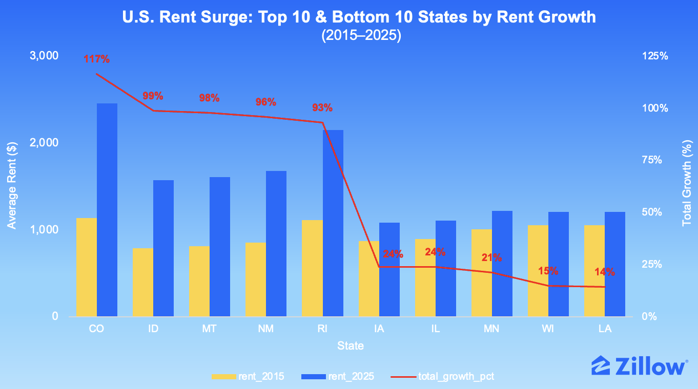
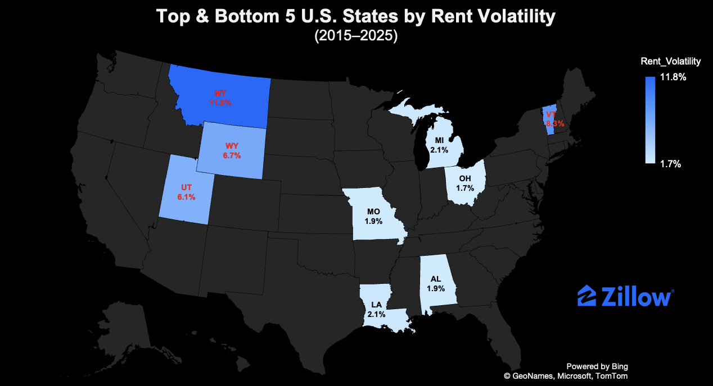
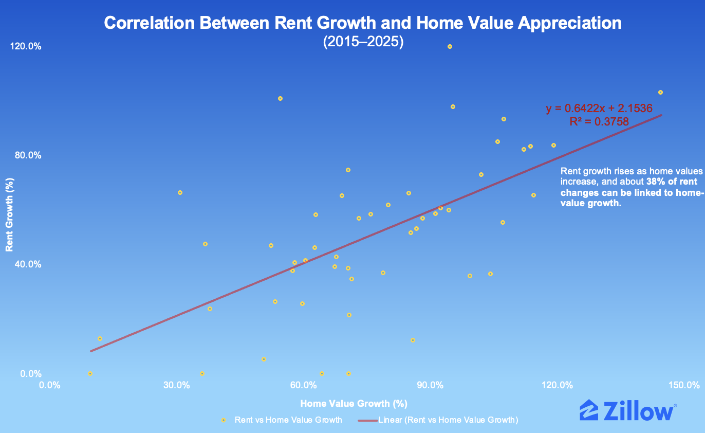
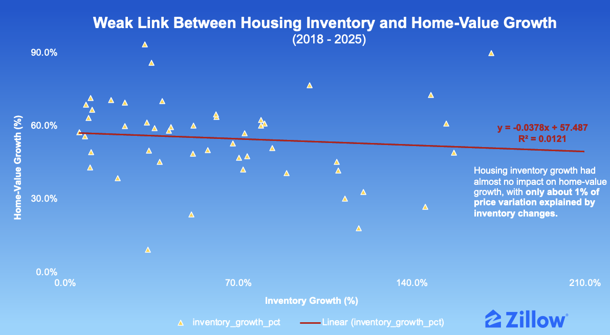
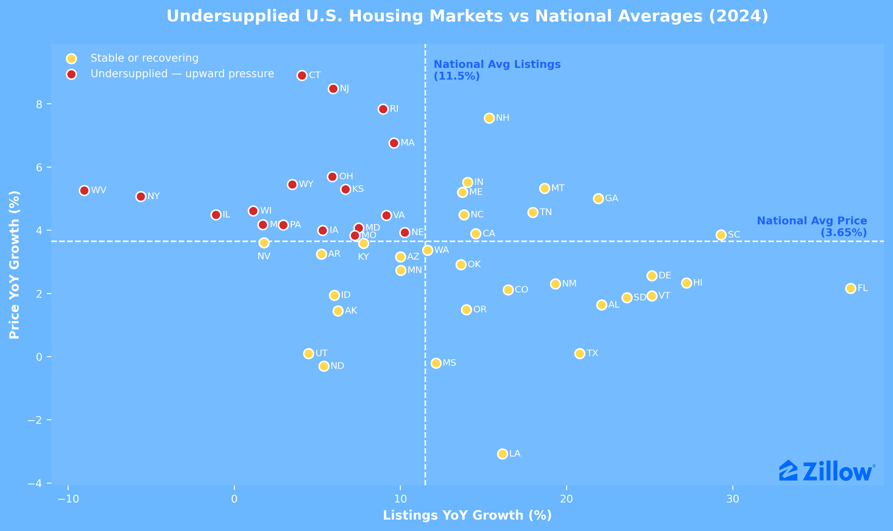

<!-- Zillow Logo -->
<p align="center">
  
</p>


<div align="center">

# Comprehensive U.S. Housing Analytics Portfolio<br><span style="font-size: 0.65em;">(2000–2025)</span>

</div>

<div align="center">

<h1 style="font-size: 2.0em;">Project Background</h1>

</div>

Zillow is the United States' leading digital real-estate marketplace, curating nationwide data on home values, rental prices, and for-sale listings, etc. Established in 2006, the company's housing research platform has become the industry benchmark for measuring property-market trends across all 50 states.

As the U.S. housing market entered two decades of economic transformation — spanning the 2008 housing crash, post-crisis recovery, pandemic-driven surge, and post-2022 affordability reset — Zillow’s datasets provide an unparalleled window into how property values, rents, and inventory levels evolved across states and regions.

This portfolio converts over **108,000 data observations** from Zillow Research into actionable insights that **help real estate investors, developers, and policymakers understand market cycles, assess regional performance, and anticipate future affordability pressures.**

Reporting to housing-sector stakeholders, **this comprehensive analysis evaluates Zillow data from 2000 to 2025 to surface key patterns in value appreciation, rent growth, and inventory shifts — and connects them to underlying economic realities.**

<div align="center">

<h1 style="font-size: 2.0em;">Core Analytical Dimensions</h1>

</div>

**The report focuses on four primary lenses of housing-market performance:**

- **Home Value Trends: Long-term appreciation, volatility cycles, and regional divergence (2000–2025).**
- **Rent Value Trends: Rental inflation, affordability, and correlation to home values (2015–2025).**
- **For-Sale Inventory Trends: Supply recovery, structural shortages, and post-pandemic resilience (2018–2025).**
- **Cross-Metric Relationships: Interactions between supply, home values, and rents that drive affordability.**

<div align="center">

<h1 style="font-size: 2.0em;">Executive Summary</h1>

</div>

### Project 01 — Home Value Index Analysis (2000–2025)

Over 25 years of Zillow Home Value Index (ZHVI) data show that U.S. national average home values rose by **+140%** (from $153K to $366K).  
While national appreciation has been strong, it masks widening volatility gaps: Mountain West and Sun Belt states led growth post-2011, while Midwest states displayed steady resilience. The 2008 crash revealed that regions with flexible supply and affordability — like Arizona and Colorado — recovered faster than constrained coastal markets.

### Project 02 — Rent Value Index Analysis (2015–2025)

Across a decade of Zillow Rent Index (ZORI) data, rents surged **over 95%** in Western markets but grew less than 20% in the Midwest and South. Rental volatility peaked between 2021–2022, reflecting migration and affordability stress. Rent and home-value appreciation remain moderately **correlated (R² = 0.38)**, confirming that both ownership and rental pressures move together.

### Project 03 — For-Sale Inventory Analysis (2018–2025)

Post-pandemic inventory data reveal that nearly half of U.S. states remain structurally undersupplied.  
Despite listing growth in flexible Southern and Mountain West regions, home prices show minimal short-term sensitivity **(R² ≈ 0.01)** to inventory fluctuations — proving that affordability challenges stem from chronic supply deficits rather than temporary demand shocks.

**Overall takeaway: The U.S. housing market's affordability crisis is structural — fueled by long-term supply shortages, regional migration, and persistent price inelasticity.**

<div align="center">

<h1 style="font-size: 2.0em;">Dataset Structure</h1>

</div>

The database consists of three primary raw datasets with a total of **108,000+ data observations** across all 50 U.S. states from 2000 to 2025.

| Dataset | Coverage | Key Columns (Raw Data) | Data Types | Purpose |
|---------|----------|------------------------|------------|---------|
| **ZHVI_HOME_VALUES** | 2000–2025 | `RegionID`, `SizeRank`, `RegionName`, `RegionType`, `StateName`, `[YYYY-MM-DD]` (monthly columns) | Integer, String, Float64 | Home value trends and appreciation analysis |
| **ZORI_RENT_INDEX** | 2015–2025 | `regionid`, `sizerank`, `regionname`, `regiontype`, `statename`, `[YYYY_MM_DD]` (monthly columns) | Integer, String, Float64 | Rental inflation and affordability tracking |
| **FOR_SALE_INVENTORY** | 2018–2025 | `RegionID`, `SizeRank`, `RegionName`, `RegionType`, `StateName`, `[YYYY-MM-DD]` (monthly columns) | Integer, String, Integer | Supply levels and inventory analysis |

**Table Relationships (After Aggregation):**
```
ZHVI_HOME_VALUES ──[StateName → statename, year]──► ZORI_RENT_INDEX
        │                                                  │
        │                                                  │
        └──[StateName, year]──► FOR_SALE_INVENTORY ◄──[StateName, year]──┘
```

**Join Logic:**
- Raw monthly data is aggregated to yearly averages by state
- All tables join on **state** (mapped: `StateName` ↔ `statename`) and **year** after aggregation
- Enables cross-metric analysis: home values vs. rents, inventory vs. prices, rents vs. supply

---

<div align="center">

<h1 style="font-size: 2.0em;">Insights Deep-Dive</h1>

</div>

<div align="center">

## ****Project 01 — Home Value Index Analysis (2000–2025)****

</div>

<div style="border: 2px solid #ddd; padding: 15px; margin: 20px 0; border-radius: 5px;">

#### 1. Which Top 10 States Achieved the Fastest Home Value Growth Over the Past Two Decades?

<div align="center">
  
</div>

From 2000 to 2025, U.S. home values increased **+140%**, rising from $153K → $366K.

Among the Top 10 states, Hawaii ($880K) and California ($870K) maintain the highest average home values, followed by Massachusetts ($701K) and New Jersey/Washington ($653K).

Western states such as Colorado and Utah show the fastest sustained appreciation, underscoring long-term regional growth patterns.

</div>

<div style="border: 2px solid #ddd; padding: 15px; margin: 20px 0; border-radius: 5px;">

#### 2. Which States Recorded the Largest Home Value Increases — in Dollars and in Growth Rate? (2000–2025)

<div align="center">
  
</div>

Idaho and Hawaii led U.S. home-value appreciation, with gains exceeding +290% and price increases up to $650K.

Rhode Island, New Hampshire, and Florida followed with steady growth between +240%–270%.

While Hawaii's surge reflects high absolute prices, Idaho's exceptional percentage growth highlights the rise of emerging inland markets.

Together, these patterns reveal a broad nationwide housing expansion—driven by both premium coastal demand and strong inland momentum.

</div>

<div style="border: 2px solid #ddd; padding: 15px; margin: 20px 0; border-radius: 5px;">

#### 3. Which U.S. States Show the Most Stable vs. Volatile Home-Value Trends (2000–2025)?

<div align="center">
  
</div>

From 2000 to 2025, Kansas (15%), Nevada (12.8%), and Arizona (11.2%) posted the highest price volatility, while Iowa, Alaska, and Louisiana remained the most stable, each below 4%.

Coastal and boom-cycle markets like Florida and Idaho also showed elevated swings, contrasting with the steadier Midwest and South.

This variation underscores the U.S. housing market's diverse risk–return profile—volatile states offer higher upside but sharper corrections, whereas stable regions reflect resilient local economies and balanced supply–demand dynamics.

</div>

<div style="border: 2px solid #ddd; padding: 15px; margin: 20px 0; border-radius: 5px;">

#### 4. How Did U.S. States Experience and Recover from the 2008 Housing Crash (2007–2015)?

<div align="center">
  
</div>

Between 2007 and 2009, several states suffered sharp home-value declines as the housing bubble burst.

California (-23.6%), Arizona (-28.2%), Arkansas (-32.0%), Alabama (-32.4%), and Alaska (-41.3%) were the hardest hit, reflecting steep corrections after years of rapid pre-crash appreciation.

From 2009 to 2015, recovery unfolded unevenly: Arizona (+31%), Wyoming (+28%), Oklahoma (+20%), North Dakota (+18%), and New Mexico (+18%) rebounded the fastest—driven by affordability, stronger local economies, and energy-sector resilience.

</div>

<div style="border: 2px solid #ddd; padding: 15px; margin: 20px 0; border-radius: 5px;">

#### 5. How Do Home-Value Trends Differ Across U.S. Regions (2000–2025)?

<div align="center">
  
</div>

From 2000 to 2025, U.S. housing markets moved through three major cycles:

**Boom (2000–2006)**

**Crash (2007–2011)**

**Sustained Recovery (2012–2022)**

The West experienced the strongest swings (peak +16.2% in 2005, trough -17.1% in 2009, surge +17.2% in 2021).

The Midwest and Northeast showed more stable paths, while the South accelerated post-2012—driven by affordability and migration inflows.

</div>

---

<div align="center">

## ****Project 02 — Rent Value Index Analysis (2015–2025)****

</div>

<div style="border: 2px solid #ddd; padding: 15px; margin: 20px 0; border-radius: 5px;">

**Executive Summary**

From 2015 to 2025, U.S. rental markets diverged sharply. **Colorado** led with 120% growth ($1,122 → $2,467), while **Hawaii** and **California** maintained premium pricing ($2,922 and $2,302 respectively in 2025). The decade unfolded in three phases: stable pre-pandemic growth (2–6% annually), a 2021–2022 surge where **Montana** peaked at **37%** YoY growth, and post-pandemic normalization to 2–5% annual increases.

**Key findings from state average rent analysis (2015–2025):**
- **Top growth states:** Colorado (+120%), Idaho (+103%), New Mexico (+101%), Montana (+98%), Rhode Island (+93%)
- **Largest absolute increases:** Colorado (+$1,345), Rhode Island (+$1,039), Hawaii (+$923), Connecticut (+$901), Florida (+$887)
- **Premium markets (2025):** Hawaii ($2,922), Colorado ($2,467), California ($2,302), Massachusetts ($2,240), Rhode Island ($2,153)
- **Most affordable markets (2025):** Iowa ($1,029), Kansas ($1,030), West Virginia ($1,064), Illinois ($1,091), Indiana ($1,096)

**Strategic insight:** Western and Mountain states (CO, ID, MT, AZ, UT) delivered both high base rents and strong absolute dollar growth, while Midwestern markets (OH, MO, IA, WI) offered stability with consistent 2–5% growth and minimal volatility—creating distinct risk-return profiles for investors.

</div>

#### 1. Which states experienced the fastest and slowest rent growth?

<div align="center">
  
</div>

Between 2015 and 2025, rent values grew unevenly across the United States.

**Colorado, Idaho, and Montana** led the nation with increases above **95%**, while **Wisconsin** and **Louisiana** recorded growth below **20%**.

The data reveals a clear regional divide — Western states experienced the strongest rent escalation, whereas the Midwest and South remained more stable.

High-growth states indicate strong demand but growing affordability pressure, while slower-growth markets remain stable and accessible.

#### 2. Where Were Rental Markets the Most Volatile — and Which States Remained Stable?

<div align="center">
  
</div>

Rent fluctuations varied widely across regions.

**Montana (11.8%)**, **Vermont (8.3%)**, and **Wyoming (6.7%)** recorded the highest volatility, showing larger year-to-year swings.

In contrast, **Ohio (1.7%)**, **Missouri (1.9%)**, and **Alabama (1.9%)** remained the most stable, with minimal variation throughout the decade.

These differences highlight contrasting market dynamics — some states saw sharp annual changes while others maintained consistent rental patterns.

High-volatility markets carry greater short-term potential and risk, while stable states offer predictable, long-term rental returns.

#### 3. The Relationship Between Home-Value Appreciation and Rent Growth Across U.S. States (2015–2025)

<div align="center">
  
</div>

The analysis reveals a **moderate positive relationship (R² = 0.38)** between rent growth and home-value appreciation.

States with faster home-value increases generally experienced stronger rent growth, although the strength of this link varied by region.

This pattern suggests that property and rental markets often move together, reflecting shared economic pressures.

As home values rise, rents tend to follow — reinforcing the relationship between property appreciation and rental affordability across states.

---

<div align="center">

## ****Project 03 — For-Sale Inventory Analysis (2018–2025)****

</div>

#### For-Sale Listing Executive Summary

From 2019 to 2025, U.S. housing inventory experienced a dramatic cycle of contraction and recovery.

**Pandemic Contraction (2019–2021):** Most states saw sharp inventory declines, with New Hampshire (-46.6% in 2021), Vermont (-47.7% in 2021), and South Carolina (-38.9% in 2021) experiencing the steepest drops. By 2021, average listings had fallen 20–30% across most markets as pandemic-driven demand surged while supply tightened.

**Recovery Acceleration (2022–2025):** Southern and Mountain West states led the rebound. **Florida** posted the strongest recovery (+37.1% in 2024, +19.3% in 2025), followed by **South Carolina** (+29.3% in 2024), **Nevada** (+29.5% in 2025), and **Arizona** (+25.6% in 2025). These regions benefited from population inflows, flexible development environments, and land availability.

**Persistent Constraints:** Several Northeastern and Midwestern markets remain supply-constrained. **Illinois** (-1.6% in 2025), **Wisconsin** (-0.8% in 2025), and **New York** (+3.4% in 2025) show minimal recovery, reflecting slower permitting processes, higher construction costs, and limited developable land.

The data reveals a **structural regional divide**: supply-responsive states are normalizing inventory levels, while constrained markets face chronic undersupply that sustains affordability pressures.

#### 1. What is the relationship between inventory growth and home-value change?

<div align="center">
  
</div>

Correlation analysis reveals that home-value growth is largely insensitive to short-term inventory fluctuations **(R² ≈ 0.01)**. In most states, prices continued to rise despite increasing listings, suggesting that demand-side factors such as income growth, household formation, and borrowing costs play a more dominant role than supply adjustments in the near term.

This pattern underscores the inelastic nature of housing prices in the short run. Even when new listings increase, the market's ability to translate supply expansion into price moderation remains limited without parallel adjustments in demand fundamentals. Long-term price stability depends on persistent, multi-year increases in housing stock rather than cyclical listing growth.

#### 2. How Do States Compare to National Supply Benchmarks?

<div align="center">
  
</div>

When benchmarked against national averages, most Southern and Mountain West states exhibit inventory growth above 11.5%, while many Northeastern markets remain below. The regional divide suggests that supply recovery is concentrated in states with more flexible development environments and stronger in-migration, while legacy markets are adjusting more slowly.

The uneven recovery underscores a structural bifurcation of the U.S. housing market. Supply-responsive regions are gradually stabilizing, with inventory levels returning toward pre-2020 norms, while supply-constrained regions remain chronically tight. This geographic imbalance will continue to influence national affordability, migration trends, and regional investment patterns.

---

<div align="center">

### Cross-Metric Summary

</div>

Home values and rents move together, with rent growth lagging ownership cycles by roughly one year.  
Inventory recovery correlates negatively with both value and rent acceleration, confirming supply constraints as the primary affordability driver.  
Elastic markets (TX, FL, CO) maintain price stability and rental balance, while constrained markets (HI, MA, NJ) remain under chronic affordability stress.  
→ Collectively, the data confirms that supply elasticity—not demand fluctuation—is the defining determinant of long-term housing affordability.

---

<div align="center">

<h1 style="font-size: 2.0em;">Recommendations</h1>

</div>

The findings across Zillow's datasets highlight that restoring balance to the U.S. housing market requires coordinated action from real estate developers, investors, corporate stakeholders, and policymakers.

Each group has a distinct but interdependent role in addressing structural supply shortages, managing volatility, and improving long-term affordability.

**Real Estate Developers**

- Accelerate supply in undersupplied regions: Prioritize construction in states where inventory growth lags but demand and prices remain high.
- Streamline project approvals: Collaborate with local authorities to modernize zoning and shorten permitting cycles.
- Leverage market analytics: Use home value, rent, and inventory data to identify profitable development corridors and optimize timing.

**Investors**

- Diversify portfolios geographically: Balance exposure between high-growth Western markets and steady-performing Midwest and Southern states.
- Track rent–price relationships: Monitor cross-market correlations to anticipate affordability inflection points.
- Invest in sustainable housing: Channel capital toward affordable and energy-efficient developments that offer stable, long-term returns.

**Corporate Stakeholders**

- Integrate housing data into strategy: Build dashboards that track home values, rents, and supply to inform workforce planning and real-estate investment.
- Align business operations with affordability trends: Consider housing costs when making decisions about expansion, compensation, or relocation.
- Foster partnerships: Work with local developers and governments to ensure accessible housing near employment hubs.

**Policymakers**

- Enable long-term supply elasticity: Reform restrictive zoning laws and expand infrastructure to unlock new development capacity.
- Facilitate public–private partnerships: Use incentives, housing trust funds, and financing tools to encourage private sector participation.
- Promote affordability and transparency: Support balanced rental frameworks and open access to housing data for evidence-based policy design.

---

<div align="center">

<h1 style="font-size: 2.0em;">Data Attribution</h1>

</div>

Data © Zillow Group, Inc. (ZHVI, ZORI, For-Sale Inventory) — used under Zillow Research Terms of Use for educational, non-commercial analysis.
