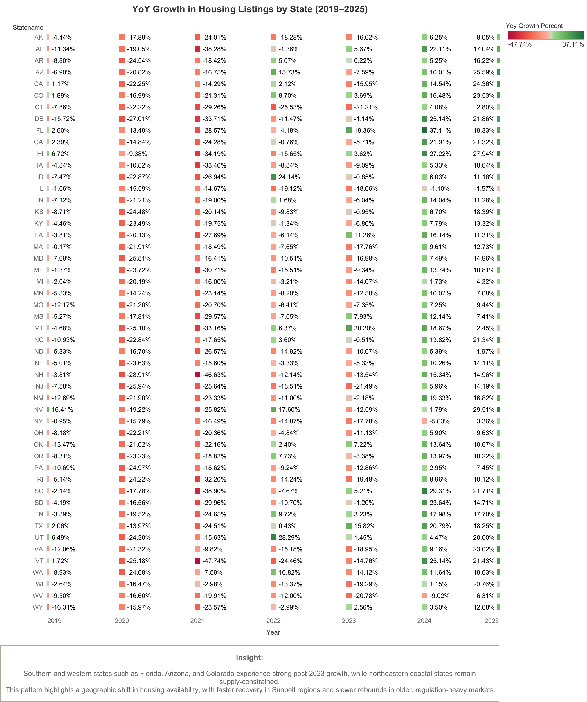
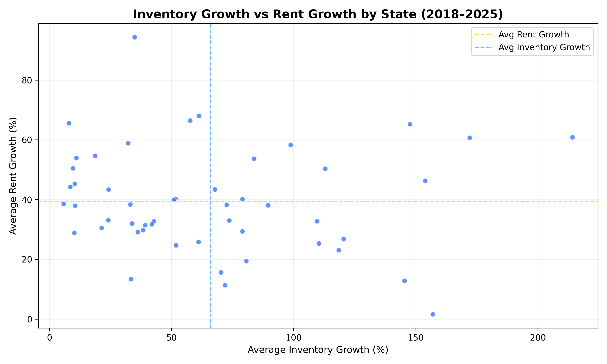
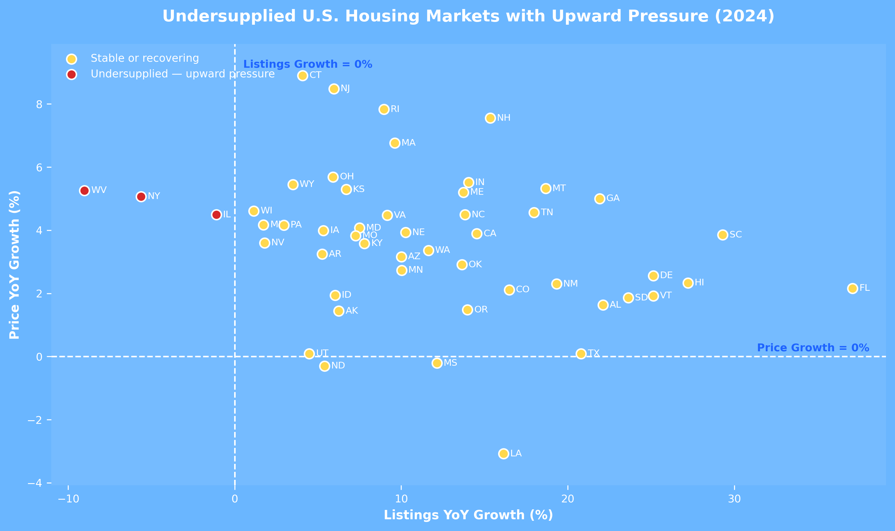

<h1 align="center">Zillow</h1>

# U.S. Housing Marketing Performance Report  
### End-to-end insights across Zillow home values, rents, and inventory (2000 – 2025)

> A three-project portfolio that blends SQL, Python, and Excel to explain how U.S. housing prices, rents, and supply evolved through multiple market cycles.

---

## Project Background  
Zillow is the United States’ leading digital real-estate marketplace, curating national coverage of property values, rental prices, and for-sale inventory. This portfolio converts more than **108,000 observations** from Zillow Research into business-ready intelligence that helps real-estate operators, investors, policymakers, and community stakeholders make faster, better-informed housing decisions. Each project follows a consistent workflow—data acquisition, cleaning, enrichment, visualization, and storytelling—to surface how U.S. housing dynamics evolved from 2000 through 2025.

---

## Executive Summary  
- **Project 01 – Home Value Index Analysis (2000–2025):** Distills 25 years of Zillow Home Value Index (ZHVI) data to quantify **+140% national appreciation** ($153K → $366K), highlight regional volatility gaps, and identify the states that recovered fastest from the 2008 housing crisis.  
- **Project 02 – Rent Value Index Analysis (2015–2025):** Measures the pace and stability of rental inflation across every state, revealing **>95% rent growth** in high-demand Western markets, sub-20% growth in Midwest/Southern states, and a **moderate rent-to-price relationship (R² = 0.38)**.  
- **Project 03 – For-Sale Inventory Analysis (2018–2025):** Benchmarks supply recovery in the post-pandemic era, showing that roughly half of states remain undersupplied and that home prices are **insensitive to short-term inventory swings (R² ≈ 0.01)**—evidence that structural supply gaps keep pressure on affordability.

---

## Insights Deep-Dive  

### Project 01 — Home Value Index Analysis  
**Key questions analyzed:**
1. `Which states achieved the fastest sustained home value growth from 2000 to 2025?`  
     
   - *Insight:* National values climbed **+140% ($153K → $366K)**, with Hawaii and California holding the highest averages and emerging Mountain West states accelerating fastest.  
   - *Business interpretation:* Premium coastal markets sustain pricing power; growth corridors like Colorado and Utah highlight long-term expansion plays.  
2. `Which states recorded the largest dollar gains versus percentage growth?`  
     
   - *Insight:* Idaho’s +290% surge underscores inland momentum, while Hawaii’s $650K absolute gain reflects entrenched coastal demand—together signaling broad nationwide expansion.  
   - *Business interpretation:* Pair percentage-growth leaders with high-dollar markets to balance upside potential and luxury exposure.  
3. `Which markets exhibit the most volatile versus stable home-value trends?`  
     
   - *Insight:* Kansas, Nevada, and Arizona show double-digit volatility while Iowa, Alaska, and Louisiana stay below 4%, mapping a clear risk–return spectrum.  
   - *Business interpretation:* Investors can trade higher upside for steadier Midwest performance; operators modulate incentives in swing markets.  
4. `How did states experience and recover from the 2008 housing crash?`  
     
   - *Insight:* California and Arizona plunged more than 20%, yet post-2011 rebounds were fastest in Arizona, Wyoming, and Oklahoma, emphasizing the role of affordability and sector resilience.  
   - *Business interpretation:* Stress-testing portfolios against boom-bust cycles remains critical; recovery velocity informs land banking.  
5. `How do home-value trends vary across U.S. regions?`  
     
   - *Insight:* Western markets cycle from +16% peaks to -17% troughs, while Midwest and Northeast arcs are smoother, highlighting divergent market elasticity.  
   - *Business interpretation:* Regional diversification dampens shocks; policy makers can benchmark cycle amplitude for resilience planning.

### Project 02 — Rent Value Index Analysis  
**Key questions analyzed:**
1. `Which U.S. states experienced the fastest and slowest rent growth (2015–2025)?`  
     
   - *Insight:* Colorado, Idaho, and Montana exceeded **95% rent growth**, whereas Wisconsin and Louisiana stayed below 20%, illustrating a sharp West-versus-Midwest divide.  
   - *Business interpretation:* Developers chase high-demand corridors; affordability advocates focus on slower-growth states to preserve access.  
2. `Where were rental markets the most volatile versus stable?`  
     
   - *Insight:* Montana (11.8%) and Vermont (8.3%) swing hardest year to year, while Ohio, Missouri, and Alabama hold variance under 2%, defining risk bands for rent cash flows.  
   - *Business interpretation:* Lenders price risk premiums into volatile metros; institutional landlords lean into steady Midwest returns.  
3. `What is the relationship between rent growth and home-value appreciation?`  
     
   - *Insight:* A moderate positive correlation (R² = 0.38) confirms that ownership and rental markets generally rise together, reinforcing affordability pinch points.  
   - *Business interpretation:* Policy and capital allocation should treat rents and prices as linked pressures when modeling intervention timing.

### Project 03 — For-Sale Inventory Analysis  
**Key questions analyzed:**
1. `How have for-sale listings evolved year over year across states (2018–2025)?`  
     
   - *Insight:* Southern and Mountain West states post sustained inventory rebounds post-2020, whereas Northeast corridors remain constrained by permitting and land scarcity.  
   - *Business interpretation:* Builders prioritize high-capacity regions; policymakers fast-track approvals in chronically tight states.  
2. `What is the relationship between inventory growth and home-value growth?`  
     
   - *Insight:* With R² ≈ 0.01, prices stay elevated even when listings rise, signaling demand-side dominance and supply inelasticity in the short run.  
   - *Business interpretation:* Affordability strategies must extend beyond episodic listing spikes; long-horizon supply expansion is required.  
3. `How does inventory growth compare with rent growth?`  
     
   - *Insight:* States with limited inventory recovery—Hawaii, New York, Massachusetts—also show elevated rent gains, proving ownership scarcity migrates pressure to rentals.  
   - *Business interpretation:* Coordinated rental and ownership policies are needed to relieve cost burdens where supply gaps persist.  
4. `Which markets remain undersupplied and face continued upward pressure?`  
     
   - *Insight:* Connecticut, New Jersey, and Rhode Island sit below national supply growth yet above price growth averages, signaling entrenched shortages.  
   - *Business interpretation:* Incentivize targeted development and zoning reform to unlock inventory in these high-pressure corridors.  
5. `How do states compare to national supply benchmarks?`  
     
   - *Insight:* Supply recovery is concentrated in flexible Southern and Mountain states, whereas legacy Northeast markets lag, creating a structural two-speed housing landscape.  
   - *Business interpretation:* Investors stagger capital toward responsive regions while public agencies support infrastructure that unlocks lagging markets.

---

## Recommendations  
- **Scale supply where price pressure persists:** Fast-track permitting, infrastructure, and public–private initiatives in Northeast and coastal states that remain below national inventory benchmarks yet above-average price growth.  
- **Balance portfolios with volatility-aware deployment:** Pair Western/Mountain exposure (higher appreciation, higher swings) with Midwest/Southern holdings for resilient cash flow and risk-adjusted returns.  
- **Align rental strategies to affordability goals:** Expand multifamily development and rental vouchers in states posting double-digit rent growth while preserving naturally affordable stock in stable markets.  
- **Institutionalize integrated monitoring:** Maintain cross-market dashboards that track ZHVI, ZORI, and inventory in tandem so leadership teams can anticipate affordability shock points and time capital allocation.  
- **Advocate for systemic policy levers:** Support zoning modernization, infrastructure financing, and housing trust funds that enable sustained supply growth—short-term listing spikes alone will not resolve price pressure.

---

## Supporting Portfolio Overview  
- Synthesizes **108k+ housing observations** into actionable storylines for decision makers.  
- Connects **home-value appreciation (ZHVI)**, **rent dynamics (ZORI)**, and **for-sale inventory trends** to surface structural imbalances.  
- Demonstrates a repeatable analytics workflow: data acquisition → cleaning → enrichment → visualization → business recommendations.  
- Designed as a flagship piece for showcasing **market analytics, data storytelling, and stakeholder-ready deliverables**.

---

## Portfolio Scope & Objectives  
- Build a cohesive analytical narrative around Zillow’s **Home Value**, **Rent**, and **Inventory** datasets.  
- Quantify regional patterns, volatility, and market resilience across multiple economic cycles.  
- Translate quantitative findings into **investor, developer, and policy** recommendations.  
- Provide reproducible assets (SQL, Python, Excel, visual exports) for rapid stakeholder reuse.

---

## Portfolio Snapshot  

| Project | Primary Question | Core Methods | Key Outputs |
|---------|------------------|--------------|-------------|
| **01 · Home Values** | How have state-level home values grown and rebounded since 2000? | Excel (Power Query, Pivot, Charts) | Growth leaderboards, volatility scorecard, crash-to-recovery analysis |
| **02 · Rent Index** | Which states lead rent inflation and how do rents track price gains? | SQL (window functions, aggregations) + Excel | Rent growth rankings, volatility heat map, rent–price correlation plot |
| **03 · Inventory** | Where does supply remain tight and what does that mean for prices? | SQL + Python (Pandas, Matplotlib) + Excel | YoY supply dashboards, inventory-price scatter, undersupply benchmark charts |

---

## Data Sources  

| Data Asset | Coverage | Frequency | Metrics | Used In |
|------------|----------|-----------|---------|---------|
| Zillow Home Value Index (ZHVI) | 2000–2025 | Monthly → annual avg | Median home value, YoY %, CAGR, volatility | Project 01 & cross-project benchmarks |
| Zillow Rent Index (ZORI) | 2015–2025 | Monthly → annual avg | Typical rent, YoY %, volatility, rent-price correlation | Project 02 & cross-project synthesis |
| Zillow For-Sale Inventory | 2018–2025 | Monthly → annual avg | Listings count, YoY growth, supply vs. price metrics | Project 03 & cross-project synthesis |

> Raw assets sourced from Zillow Research. All transformations documented inside project folders.

---

## Analytics Workflow & Tooling  
- **Data engineering:** SQL scripts and Power Query to reshape long time-series data.  
- **Analysis:** Python (Pandas, NumPy) and Excel to compute growth, volatility, and correlations.  
- **Visualization:** Matplotlib and Excel charting for stakeholder-ready figures.  
- **Quality controls:** Transparent folder structure, reproducible scripts, and cross-checks between rents, prices, and inventory to validate insights.  
- **Storytelling:** Executive summaries, business implications, and recommendations aligned to investor/developer/policy use cases.

---

## Cross-Market Signals  
- **Affordability strain is structural:** Inventories remain below national norms in coastal/Northeast markets, keeping both prices and rents elevated despite softening demand.  
- **Migration reshapes winners:** Mountain West and Sun Belt states capture outsized growth across values, rents, and listings, reflecting population inflows and development capacity.  
- **Risk management requires diversification:** Combining high-growth (West/Mountain) and steady (Midwest/South) markets balances return potential with cash-flow stability.  
- **Policy lever:** Zoning reform and long-term supply investment are critical; single-year listing spikes do not materially dent price trajectories.

---

## Repository Structure  

```
.
├── 01_zillow_home_value_index_analysis/
│   ├── data/ (raw ↔ clean)
│   ├── outputs/ (charts, summary tables)
│   ├── scripts/ (Excel workflow notes)
│   └── README.md
├── 02_zillow_rent_value_index_analysis/
│   ├── data/
│   ├── outputs/
│   ├── scripts/sql/
│   └── README.md
├── 03_for_sale_listings_analysis/
│   ├── data/
│   ├── outputs/
│   ├── scripts/ (Python + SQL)
│   └── README.md
└── README.md  ← you are here
```

---

## How to Reproduce  
1. Clone the repository and install Python 3.11+ if running the inventory analysis notebooks/scripts.  
2. Download the Zillow datasets (links embedded in each project README) into the `data/raw/` folders.  
3. Follow project-specific instructions:  
   - **Project 01:** Open the Excel workbook, enable Power Query, refresh connections.  
   - **Project 02:** Execute SQL scripts in `02_zillow_rent_value_index_analysis/scripts/sql/`, then refresh linked Excel charts.  
   - **Project 03:** Run Python scripts in `03_for_sale_listings_analysis/scripts/python/` to regenerate processed tables and figures.  
4. Compare regenerated charts with the `outputs/` folders to validate results.  
5. Use the visuals and executive summaries for presentation decks or stakeholder briefings.

---

## Next Steps  
- Extend analyses to metro-level cuts to highlight local affordability hotspots.  
- Layer in macro drivers (mortgage rates, income growth, employment) for multi-factor modeling.  
- Build an interactive Tableau/Power BI dashboard that unifies the three datasets for real-time storytelling.  
- Automate scheduled refreshes to maintain an up-to-date housing analytics observatory.

---

## Data Attribution  
Data © Zillow Group, Inc. (ZHVI, ZORI, For-Sale Inventory) — used under Zillow Research Terms of Use for educational, non-commercial analysis.

---

## 👤 Author  
**Qin Qin**  
Data Analytics Portfolio · Real Estate · Market Trends  
🔗 [GitHub](https://github.com/Qin717) · [LinkedIn](https://www.linkedin.com/in/qinqin0717)

> This portfolio aligns with best practices for housing market analytics, echoing professional storytelling standards showcased in industry case studies such as TechSphere’s e-commerce analytics report^[https://github.com/CamilingJS/TechSphere_Ecommerce?tab=readme-ov-file] while adapting them to the U.S. real-estate landscape.
