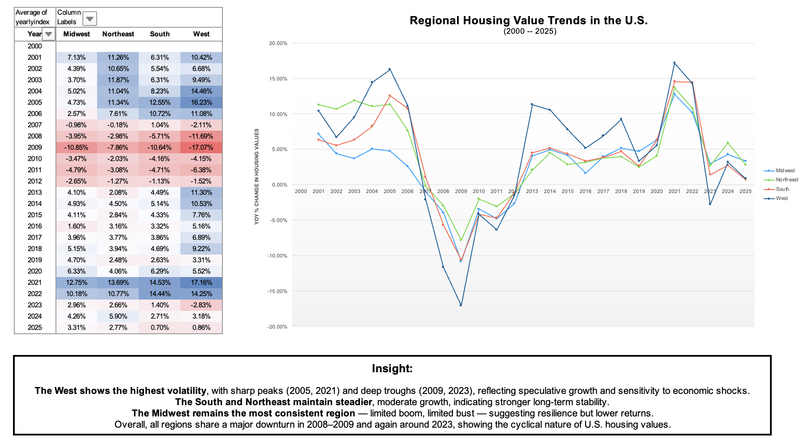
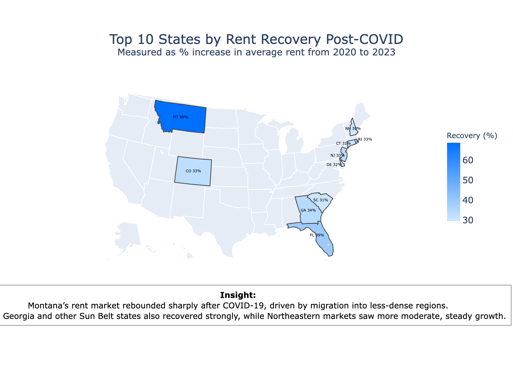

# 🏠 U.S. Housing Market Analytics (2000–2025)

**Comprehensive U.S. Housing and Rent Market Analysis (2000–2025)**  
_Leveraging Zillow Research datasets (ZHVI & ZORI) to uncover 25 years of U.S. housing market evolution, affordability trends, and regional performance._

---

## 1. Project Background

The U.S. housing market — one of the most critical pillars of the global economy — has experienced extraordinary cycles over the past 25 years: the early-2000s housing boom, the 2008 financial crisis, a decade-long recovery, and the post-pandemic surge and correction.  
Understanding these market shifts is essential for **investors, policymakers, and real-estate professionals** seeking to navigate volatility, forecast demand, and identify long-term opportunities for sustainable growth.

This portfolio leverages **Zillow Research’s Home Value Index (ZHVI)** and **Zillow Observed Rent Index (ZORI)** to explore how property values and rental prices evolved across the United States.  
Due to data availability differences, each dataset covers a distinct historical range:

| Dataset | Period | Focus |
|----------|---------|--------|
| **ZHVI (Home Value Index)** | 2000–2025 | Long-term housing market cycles, volatility, and structural growth |
| **ZORI (Rent Index)** | 2015–2025 | Modern rent market behavior, affordability, and post-pandemic recovery |

This dual approach provides both **long-term structural insight** (home values) and **modern affordability analysis** (rents).

### Analytical Objectives
- **Market Trend Analysis:** Examine national and regional housing value trends to identify long-term growth and contraction cycles.  
- **Crisis & Recovery Evaluation:** Quantify the impact of major economic disruptions — including the 2008 financial crash and the 2020 pandemic — on home and rent values.  
- **Regional Performance Comparison:** Assess how U.S. regions (West, South, Midwest, Northeast) differ in growth, volatility, and recovery strength.  
- **Investment & Policy Implications:** Translate analytical findings into actionable insights for investors, policymakers, and developers.

> **Scope:**  
> - ZHVI: 50 states · 4 regions · 2000–2025  
> - ZORI: 50 states · 4 regions · 2015–2025  

---

## 2. Data Structure & Initial Checks

### Data Sources
- **Zillow Home Value Index (ZHVI):** Monthly median home value estimates by region and state (2000–2025).  
- **Zillow Observed Rent Index (ZORI):** Monthly median rent estimates by region and state (2015–2025).  

### Data Preparation
- Cleaned and standardized datasets using **Excel Power Query** (duplicate removal, normalization, field alignment).  
- Aggregated monthly data into **annual averages** for year-over-year (YoY) growth and volatility (STDEV.P).  
- Verified completeness across all states and years within each dataset.  
- Confirmed regional consistency between ZHVI and ZORI through matching `RegionID` and `StateName`.  
- Created yearly summary tables to compute **CAGR**, **YoY Growth**, and **Volatility**.

> ✅ These steps ensured clean, consistent, and comparable datasets for both long-term and modern-period analysis.

---

## 3. Executive Summary

### Overview
The analysis reveals clear evidence of **regional divergence and structural transformation** within the U.S. housing market.  
While the West remains the most expensive, the **South and Mountain states** have shown the strongest sustained growth — driven by affordability, migration, and post-pandemic shifts.

---

### Key Findings

- **Long-Term Market Divergence (2000–2025):**  
  Western states maintained the highest home values, while Southern and inland states recorded the most consistent long-term growth, reflecting a realignment of population and economy.

- **Impact of Economic Crises:**  
  The 2008 crash caused price declines exceeding 40% in markets like Nevada and Florida. Post-2012 recovery was uneven, with inland states recovering faster.  
  The 2020 pandemic triggered a short-lived surge in housing demand, followed by a cooling in 2023–2024.

- **Post-COVID Rental Market Rebalancing (2015–2025):**  
  Rent growth surged sharply between 2020–2022, particularly in Southern and Mountain regions, where average rent growth exceeded **35% above the national trend**.

- **Volatility & Risk Patterns:**  
  Coastal states (CA, NY, MA) display higher volatility, while interior states (TX, NC, TN) show stable YoY growth — providing balanced long-term investment potential.

---

### Visual Overview

| Home Value Trends (2000–2025) | Post-COVID Rent Recovery (2015–2025) |
|--------------------------------|--------------------------------------|
|  |  |

*Comparative visualization of U.S. home-value and rent-market performance using Zillow datasets.*

---

### Tools & Methods
- **Excel Power Query** – cleaning, unpivoting, and yearly aggregation  
- **Excel Pivot Tables** – statistical summarization, volatility metrics  
- **SQL (CTEs, Window Functions)** – analytical calculations and ranking  
- **Python (Pandas, Matplotlib, Seaborn)** – automated chart generation and data visualization  
- **Excel Dashboards** – presentation and storytelling  

---

## 4. Recommendations

### For Real-Estate Investors
- **Diversify geographically:** Balance exposure between high-growth inland states and established coastal markets.  
- **Monitor volatility:** Use the standard deviation of YoY changes as a leading signal of market overheating or correction.

### For Developers & Builders
- **Prioritize expansion** in affordable, high-demand regions (South, Mountain).  
- **Leverage recovery insights** to identify early-stage expansion zones.

### For Policymakers
- **Target affordability programs** where rent inflation outpaces wage growth (notably the South post-2020).  
- **Invest in infrastructure alignment** to support migration-driven housing demand.
  
---

## 5. Data Coverage Alignment

| Dataset | Source | Coverage | Frequency | Analytical Focus |
|----------|---------|-----------|------------|------------------|
| 🏠 **ZHVI (Home Value Index)** | Zillow Research | 2000–2025 | Monthly → Yearly | Long-term housing cycles & volatility |
| 🏘 **ZORI (Rent Index)** | Zillow Research | 2015–2025 | Monthly → Yearly | Modern rent dynamics & affordability |

> The two analyses intentionally retain their native coverage periods to maintain analytical accuracy:  
> **ZHVI** captures 25 years of structural housing evolution, while **ZORI** highlights the modern rental era (2015–2025).

---

## 👤 Author

**Qin Qin**  
Data Analytics Portfolio | Real Estate · Market Trends · Visualization  
🔗 [GitHub Portfolio](https://github.com/Qin717) | [LinkedIn](https://www.linkedin.com/in/qinqin0717)

---

> 🧩 *This portfolio demonstrates an end-to-end analytics workflow — from data cleaning and SQL aggregation to Python visualization and storytelling — designed to extract actionable insights from Zillow’s long-term U.S. housing data.*
