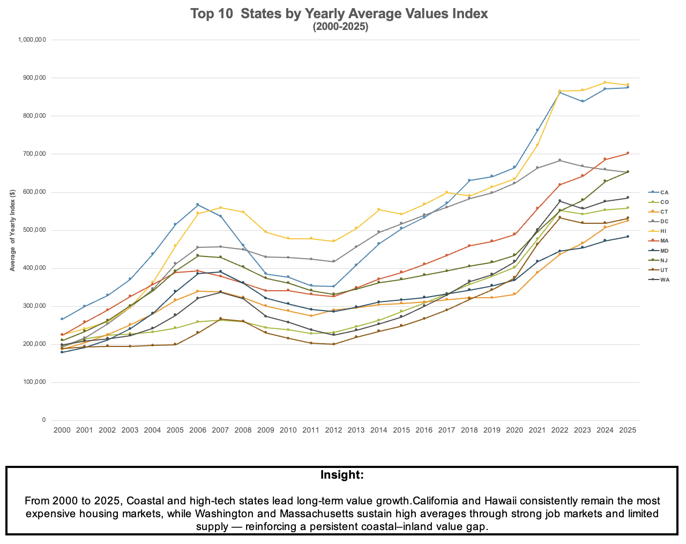
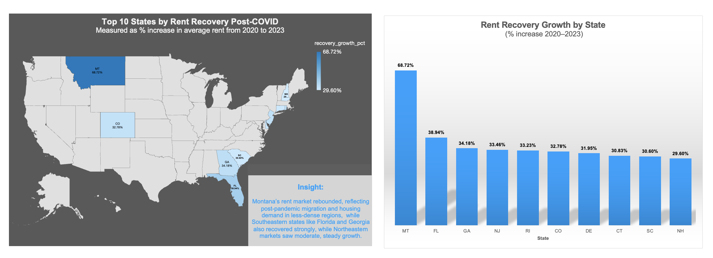

# 🏠 U.S. Housing Market Analytics (2000–2025)

This portfolio explores **25 years of U.S. housing and rental market dynamics** using Zillow Research data.  
It combines real-estate, economic, and data-analytics insights to uncover how property values and rents evolved across the U.S. — before, during, and after major market cycles such as the **2008 financial crisis** and the **COVID-19 recovery**.

💡 **Designed to demonstrate:** my ability to transform large-scale housing datasets into investor-ready insights through Excel, SQL, and data storytelling.

---

### 📈 Headline Insights
- 🏡 **Idaho and Utah home values grew over 2× faster** than the national average between 2015–2025.  
- 💸 **Southern states led post-COVID rent recovery by nearly 35%**, highlighting regional affordability shifts.

---

## 📊 Project Overview

| Project | Tools | Focus | Key Deliverables |
|----------|--------|--------|------------------|
| [01 · Zillow Home Value Index Analysis](01_zillow_home_value_index_analysis/README.md) | **Excel (Power Query, Pivot Tables)** | 6 analytical questions on U.S. home-value trends, volatility, and recovery | Dashboards · Charts · Summary Report (PDF) |
| [02 · Zillow Rent Value Index Analysis](02_zillow_rent_value_index_analysis/README.md) | **SQL (CTEs, Window Functions)** | 5 analytical questions on rent growth, volatility, and post-COVID recovery | SQL Queries · Visuals · Summary Report (PDF) |

---

## 🧠 Key Skills Demonstrated

- **Data Cleaning & Transformation** – Excel Power Query, SQL aggregation, unpivoting  
- **Analytical Modeling** – CAGR, YoY Growth, Volatility (STDEV.P), Consistency Metrics  
- **Visualization & Reporting** – Interactive Excel dashboards and summary PDFs  
- **Data Storytelling** – Translating quantitative findings into business implications  

---

## 📈 Sample Visuals

| Home Value Trends | Rent Recovery |
|--------------------|---------------|
|  |  |

---

## 💬 Business Impact

These analyses support:
- 🏘 **Real-estate investors** – identifying high-growth and volatile markets  
- 🏗 **Developers & policymakers** – understanding regional affordability and recovery trends  
- 📊 **Analysts & economists** – benchmarking long-term housing market resilience  

---

## 🧰 Tools & Techniques
**Excel · SQL**  
Data cleaning, aggregation, volatility measurement, and trend visualization.

---

## 👤 Author
**Qin QIN**  
Data Analytics Portfolio | Real Estate · Market Trends · Visualization  
🔗 [GitHub Portfolio](https://github.com/Qin717) | [LinkedIn](https://www.linkedin.com/in/qinqin0717)
